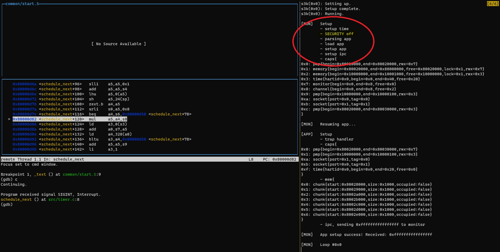
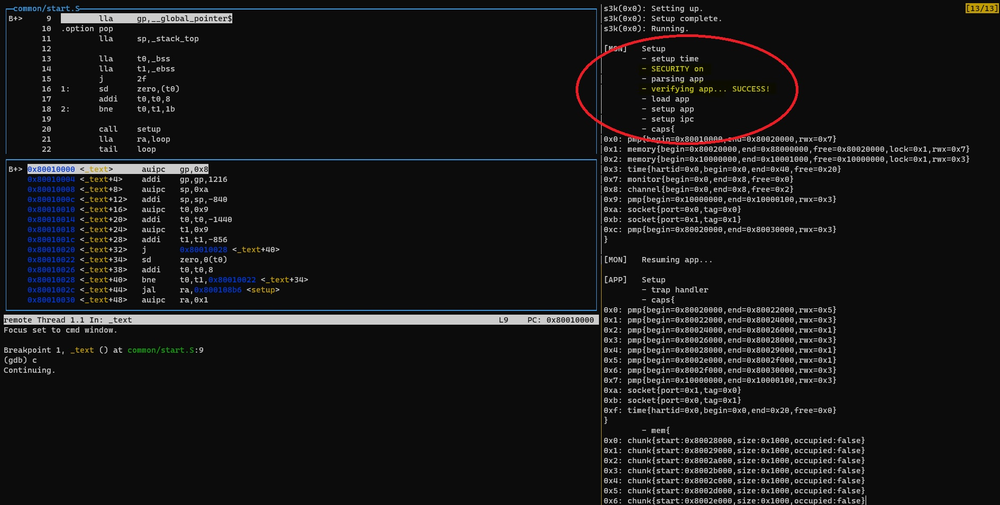
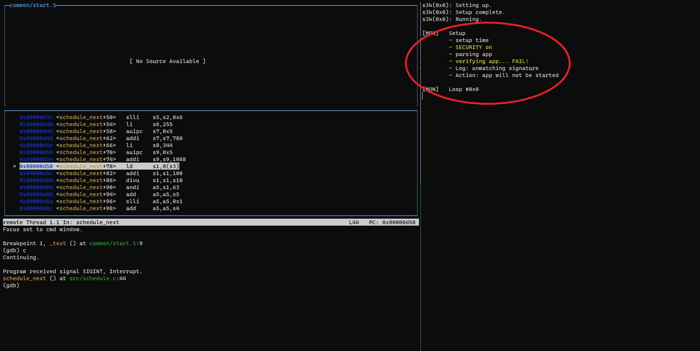
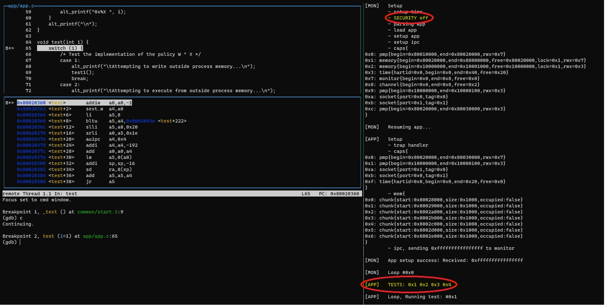
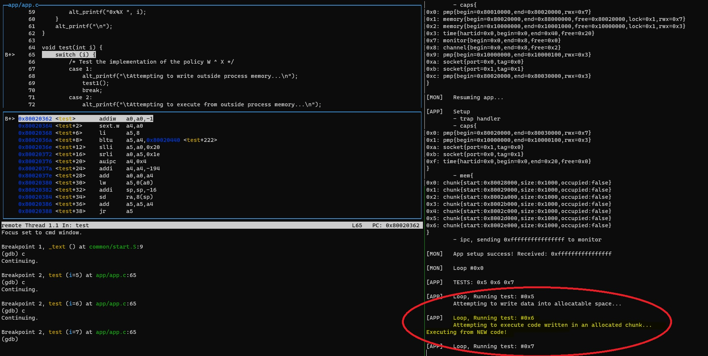
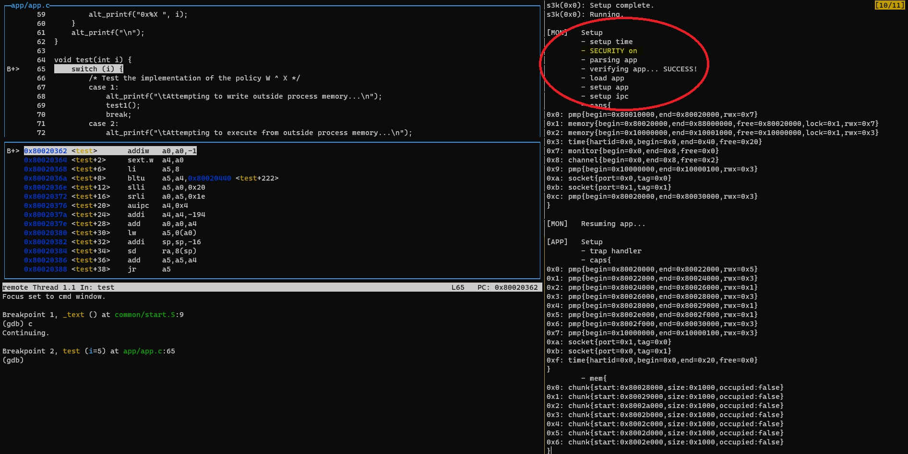
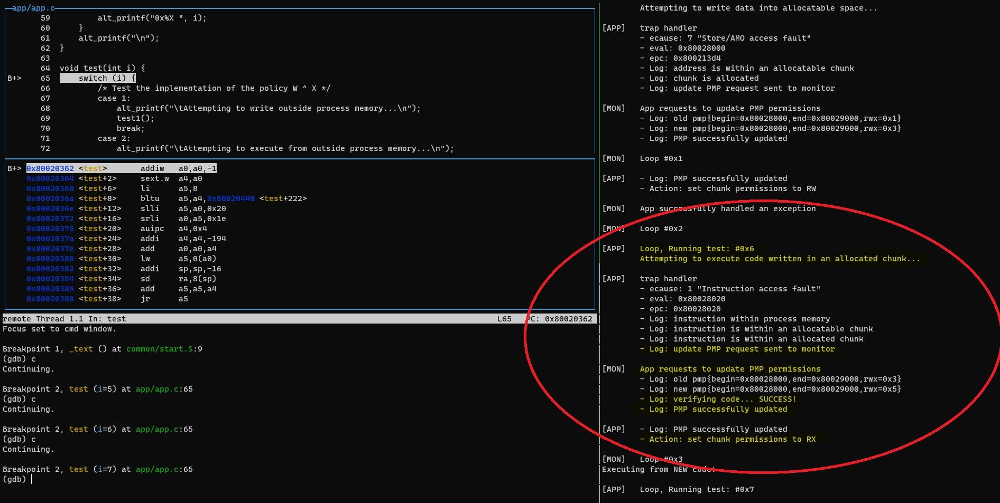
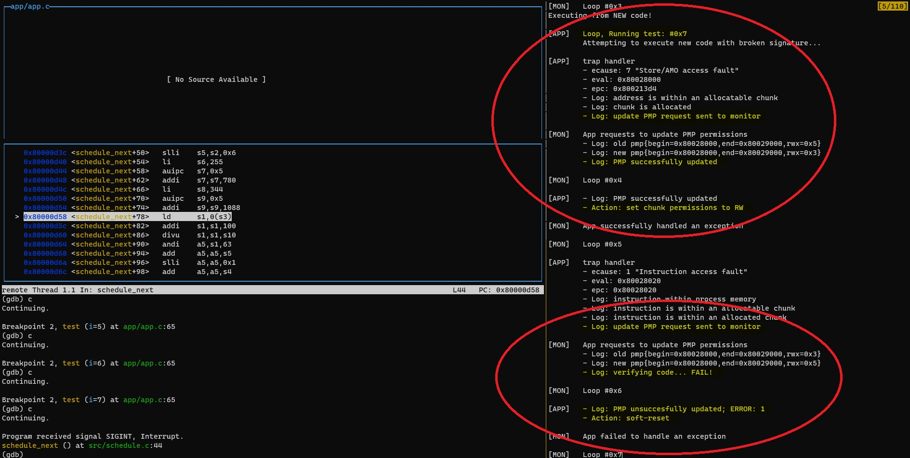

# s3k-monitor

## Project in DD2497 

This repository is a project in the course DD2497 (Project course in System Security) given by [KTH](https://www.kth.se/student/kurser/kurs/DD2497).

The project's goal is to implement security features into [kth-step/s3k](https://github.com/kth-step/s3k)  

## Project members

* Zacharias Terdin (<zacte@kth.se>)
* Elin Kårehagen (<elikare@kth.se>)

## Table of Contents
- [s3k-monitor](#s3k-monitor)
  - [Project in DD2497](#project-in-dd2497)
  - [Project members](#project-members)
  - [Table of Contents](#table-of-contents)
- [Documentation](#documentation)
  - [Overview](#overview)
  - [Quick start](#quick-start)
  - [Repository layout](#repository-layout)
    - [Notable folders and files:](#notable-folders-and-files)
  - [Dependencies and compatibility](#dependencies-and-compatibility)
    - [Required software:](#required-software)
      - [Option 1](#option-1)
      - [Option 2](#option-2)
  - [Compiling and running](#compiling-and-running)
    - [Optional notes](#optional-notes)
      - [Build docker image locally](#build-docker-image-locally)
      - [Download docker image manually](#download-docker-image-manually)
      - [Change configuration for testing](#change-configuration-for-testing)
      - [Modify persistent GDB breakpoints](#modify-persistent-gdb-breakpoints)
    - [User guide](#user-guide)
      - [Demo](#demo)
      - [Instructions](#instructions)
  - [Memory layout](#memory-layout)
- [Instructions for tester](#instructions-for-tester)
  - [Getting started](#getting-started)
  - [Test 0](#test-0)
    - [Summary](#summary)
    - [Guide](#guide)
  - [Tests 1-4](#tests-1-4)
    - [Summary](#summary-1)
    - [Guide](#guide-1)
  - [Tests 5-7](#tests-5-7)
    - [Summary](#summary-2)
    - [Guide](#guide-2)
  - [Tests 8-9](#tests-8-9)
    - [Summary](#summary-3)
---

# Documentation

## Overview

This repository consists of mainly two applications: *monitor* and *app*. The monitor is the core of this project while the app is an application which will be used to test the functionality of the monitor. 

>The purpose of the monitor is to be the first user-level process in the s3k kernel which will be responsible for *monitoring* all other user processes. The responsibilities of the monitor will be to authenticate the code of other processes, load the processes into memory, handling their capabilities to time and memory and handle certain exceptions.

**For information about the monitor see [project-proposal.md](./project-proposal.md)**

## Quick start

If you are not interested in building the project from source, prebuilt releases are available on [Github](https://github.com/zynachs/s3k-monitor/releases). Instructions are provided in the release notes.

## Repository layout

### Notable folders and files:

| Folder/File | Description |
| --- | --- |
| [app/](./app/) | Contains files which are unique to app. |
| [app/altmem.c](./app/altmem.c) | Source file for memory management. |
| [app/app.c](./app/app.c) | Source file for app main code. |
| [app/test.c](./app/test.c) | Source file for test code. |
| [app/trap.c](./app/trap.c) | Source file for trap handler code. |
| [build/](./build/) | Contains the projects compiled files and debug information. | 
| [common/](./common/) | Contains assembly and c files which are shared between monitor and app. | 
| [img/](./img/) | Contains images used in markdown files. | 
| [inc/](./inc/) | Contains header files which are shared between monitor and app. | 
| [lib/](./lib/) | Contains header archive files which are shared between monitor and app. | 
| [misc/config.h](./misc/config.h) | Header file for compiling the kernel |
| [misc/default.lds](./misc/default.lds) | Default linker script intended for linking monitor. Incompatible with PMP. |
| [misc/pmp_compatible.lds](./misc/pmp_compatible.lds) | Linker script intended for linking app. Compatible with PMP. |
| [monitor/](./monitor/) | Contains files which are unique to monitor. |
| [monitor/aes128.c](./monitor/aes128.c) | Source file for cryptography functions. |
| [monitor/codeauth.c](./monitor/codeauth.c) | Source file for signature functions. |
| [monitor/monitor.c](./monitor/monitor.c) | Source file for monitor main code. |
| [monitor/payload.S](./monitor/payload.S) | Source file for inserting app binary into monitor binary. |
| [tools/](./tools/) | Contains tools used for various functionality in the project. |
| [tools/build/](./tools/build/) | Contains compiled files and debug information for tools. |
| [tools/payloads/](./tools/payloads/) | Contains C source files used as payloads in app to test the monitors functionality. |
| [tools/app_format_sig.c](./tools/app_format_sig.c) | Source file for generating signatures for binaries. |
| [tools/app_format.c](./tools/app_format.c) | Source file for adding headers to binaries intended for the monitor. Signature and section information is included. |  
| [tools/breakpoints.txt](./tools/breakpoints.txt) | Text file containing one breakpoint per line for GDB debugging. |
| [tools/genpayload.sh](./tools/genpayload.sh) | Bash script which compiles payloads into binary files and dumps their contents in hex. It also generates signatures for each payload. |
| [tools/Makefile](./tools/Makefile) | Sub-Makefile used to compile tools. It is invoked recursively by the root Makefile. |
| [tools/qemu.sh](./tools/qemu.sh) | Bash script which emulates the kernel, monitor and app with qemu and spawns a gdb live debugging prompt. Utilizes tmux.|
| [tools/riscvpmp.py](./tools/riscvpmp.py) | Python script which translates a pmpaddr to start and end address. |
| [tools/riscvpmpinv.py](./tools/riscvpmpinv.py) | Python script which translates a start and end address to a pmpaddr. |
| [config.h](./config.h) | Header file used to configure settings in the project. | 
| [Dockerfile](./Dockerfile) | Dockerfile source which builds a build environment for the project. A prebuilt image is provided on [Github](https://github.com/users/zynachs/packages/container/package/s3k-monitor-cc) | 
| [Makefile](./Makefile) | Root Makefile used to compile and execute the entire project. |
| [project-proposal.md](./project-proposal.md) | Original project proposal markdown source, 2023-03-02. |
| [project-report.md](./project-report.md) | Final project report markdown source. |
| [README.md](./README.md) | This document. |
| [run.sh](./run.sh) | Quick-start script. Bash script which builds the project within the docker build environment and runs it. |

## Dependencies and compatibility

> **NOTE FROM DEVELOPER:** The development environment for this repository is Ubuntu Linux on [WSL](https://learn.microsoft.com/en-us/windows/wsl/install). It should be compatible with most Linux distributions but names of dependencies might differ.

### Required software:

| Software | Version | Source | Note | 
| --- | --- | --- | --- | 
| git | N/A | https://git-scm.com/ | - | 
| kth-step/s3k | commit: c0b7800 | https://github.com/kth-step/s3k/commit/c0b78005261f4725be71e103f70e61b0a8a2fee2 | Only tested and compatible with the specified commit of s3k. |

To build, test and run the project there are two options. Option 1 is the recommended solution since it is simpler and quicker to get started. 

#### Option 1

With option 1, the project is built and run within a docker container and thus requires docker. A prebuilt image is provided on [Github](https://github.com/users/zynachs/packages/container/package/s3k-monitor-cc) and it includes all the tools used to build and run the project. You can also build your own docker image with the provided [Dockerfile](./Dockerfile).

| Software | Version | Source | Note | 
| --- | --- | --- | --- | 
| Docker | N/A | https://www.docker.com/ | - | 

#### Option 2

With option 2, the project is built and run with tools on your native system. The required tools are accessible through package managers. 

| Software | Version | Source | Note | 
| --- | --- | --- | --- | 
| GNU Make | N/A | https://www.gnu.org/software/make/ | - |
| GNU Compiler | N/A | https://gcc.gnu.org/ | Standard compiler for native target. |
| Python 3 | N/A | https://www.python.org/ | - |
| RISC-V GNU Compiler Toolchain **\*** | tag: 2023.02.21 | https://github.com/riscv-collab/riscv-gnu-toolchain/releases/tag/2023.02.21 | Only tested the specified version and compiled from source. Version in package manager might be outdated. |
| QEMU **\*** | Release: 7.2.0 | https://github.com/qemu/qemu/releases/tag/v7.2.0 | Only tested the specified version and compiled from source. Version in package manager might be outdated. |

> **\*** **WARNING:** Usage of the package manager versions of *RISC-V GNU Compiler Toolchain* and *QEMU* has resulted in bugs since they are outdated (according to the developers experience). Therefore we recommend building these tools from source with newer versions. The specified versions below have been used by the developers and are also used in the docker solution, see [Option 1](#option-1). Building these tools from source is a time consuming process and also error prone since the tools themselves have dependencies which if not present will omit functionality of the tools. 

## Compiling and running

> This repository **DEPENDS** on and expects that it resides in the same parent folder as [kth-step/s3k](https://github.com/kth-step/s3k).

1. Clone both repositories.
2. Checkout kth-step/s3k to commit `c0b78005261f4725be71e103f70e61b0a8a2fee2`

```shell
git clone https://github.com/zynachs/s3k-monitor.git
git clone https://github.com/kth-step/s3k.git
cd s3k && git checkout c0b7800
```

4. Install prerequisite packages and tools.

```shell
# example installation with apt package manager
apt update && apt install -y git make build-essential python3
```

> [Option 1:](#option-1) install docker according to your [platform.](https://docs.docker.com/engine/install/)

> [Option 2:](#option-2) build tools from source or install from package manager.
> ```shell
> # example installation with apt package manager
> apt update && apt install -y gcc-riscv64-unknown-elf qemu-system-misc
> ```

5. Compile kernel, monitor and app.

> [Option 1:](#option-1) execute make commands in container via [run.sh](./run.sh). Image is automatically downloaded from [Github](https://github.com/users/zynachs/packages/container/package/s3k-monitor-cc) if it does not exist locally.
> ```shell
> cd /path/to/s3k-monitor
> ./run.sh all # equivalent to "make all" 
> ```

> [Option 2:](#option-2) execute make commands with native tools.
> ```shell
> cd /path/to/s3k-monitor
> make all
> ```

6. Execute kernel, monitor and app with qemu and launch a GDB live debugging session.

> [Option 1:](#option-1)
> ```shell
> cd /path/to/s3k-monitor
> ./run.sh # equivalent to "make run" 
> ```

> [Option 2:](#option-2)
> ```shell
> cd /path/to/s3k-monitor
> make run
> ```

### Optional notes

#### Build docker image locally

> Build duration >1h. May vary depending on internet speeds and system resources.  
> Image size ~2.5GB
 
```shell
cd /path/to/s3k-monitor
docker build -t s3k-monitor-cc:local .
```

#### Download docker image manually

> Image size ~2.5GB
```shell
docker pull ghcr.io/zynachs/s3k-monitor-cc:latest
```

#### Change configuration for testing
To change testing parameters of the project edit [config.h](./config.h). Instructions provided in comments.

#### Modify persistent GDB breakpoints
Initial breakpoints are set in [tools/breakpoints.txt](./tools/breakpoints.txt). Write one breakpoint per line and ONLY the value of the breakpoint: i.e. `app.c:loop` or `*0x80020000`, **NOT** `break app.c:loop` or `break *0x80020000`.

### User guide

The project is emulated on qemu and interacted with over a live GDB session. This is all wrapped up inside a tmux session which is created by the script [qemu.sh](./tools/qemu.sh). 

#### Demo


#### Instructions

* When the project is run it will spawn a tmux session in the current terminal.
* The first page is a help page with some useful information.
* Switch to the main page with `ctrl+b (release) n`. use the same keystroke to switch to the help page.
* The left panel contains GDB in tui mode.
* The right panel displays output from kernel, monitor and app.
* Restart the session with `ctrl+b (release) r`.
* Exit session with `ctrl+b (release) d`.
* **Note:** `ctrl+c` will not exit tmux, it will interact with the application in the current pane/window as expected.

## Memory layout

The kernel does not use virtual memory and does not have an MMU. It uses physical memory addresses and MPU (Memory Protection Unit).

>The s3k kernel is emulated on QEMU's builtin *virt* hardware board. The following information is dependant on this virtual hardware.

```
┌─────────────┬────────────────────┐     /* sections statically aligned
│   Address   │       Memory       │        to be compatible with pmp   */
├─────────────┼────────────────────┤        ┌─────────────┬─────────┐ 
│ 0x8800_0000 │ ... (RAM END)      │        │   Address   │ Section │ 
│ ...         │ ...                │        ├─────────────┼─────────┤ 
│ 0x8003_0000 │ ...                │        │ 0x8003_0000 │ ...     │ 
│ [64K]       │ APP ----------------------->│ [4K]        │ .stack  │ 
│ 0x8002_0000 │ APP ----------------------->│ 0x8001_F000 │ .stack  │ 
│ [64K]       │ MONITOR            |        │ [28K]       │ .heap   │ 
│ 0x8001_0000 │ MONITOR            |        │ 0x8002_8000 │ .heap   │  
│ [64K]       │ KERNEL             │        │ [8K]        │ .bss    │  
│ 0x8000_0000 │ KERNEL (RAM START) │        │ 0x8002_6000 │ .bss    │  
│ ...         │ ...                │        │ [8K]        │ .rodata │
│ 0x1000_0100 │ ...                │        │ 0x8002_4000 │ .rodata │
│ [256B]      │ UART               │        │ [8K]        │ .data   │
│ 0x1000_0000 │ UART               │        │ 0x8002_2000 │ .data   │
│ ...         │ ...                │        │ [8K]        │ .text   │
│ 0x0000_0000 │ ...                │        │ 0x8002_0000 │ .text   │
└─────────────┴────────────────────┘        └─────────────┴─────────┘
```

# Instructions for tester

This section describes how you can test that the project works as intended.

## Getting started

Make sure that you can run the project as described in the [user guide](#user-guide)

## Test 0

Test 0 tests that the code authentication process is working.

### Summary

| Test | Description | SECURITY off & SIG_BROKEN off | SECURITY off & SIG_BROKEN on | SECURITY on & SIG_BROKEN off | SECURITY on & SIG_BROKEN on |
| ---- | ----------- | ----------- | ------------ | --- | --- |
| 0 | Load app with a broken/valid signature. | App loaded | App loaded | Authentication success -> app loaded | Authentication failed -> app not loaded |

### Guide 

1. Edit [config.h](./config.h)
   * **comment** `#define SIG_BROKEN`
   * **comment** `#define SECURITY`
2. Run the project.
3. Switch to the main page in the tmux session.
4. Enter `c` to continue execution followed by `ctrl+c` to halt execution.
5. In the output pane you should see `SECURITY off` and the app should have finished execution.

> Security is off, which means that even if the app has a broken signature it would still load. In this case the app has a valid signature but the monitor did not check it. See <a href="#figure-1">figure 1</a>.
> <br><br>
> 
> <a id="figure-1"><i>Figure 1</i></a>

6. Exit the tmux session with `ctrl+b (release) d`.
7. Edit [config.h](./config.h)
   * **uncomment** `#define SIG_BROKEN`
   * **comment** `#define SECURITY`
8. Run the project and switch to the main page. Enter `c` followed by `ctrl+c`.
9. The output pane should look identical to the previous run.
  
> Since security is off, even though the signature is broken the monitor still loads the app.

10. Exit the tmux session with `ctrl+b (release) d`.
11. Edit [config.h](./config.h)
    * **comment** `#define SIG_BROKEN`
    * **uncomment** `#define SECURITY`
12. Run the project and switch to the main page. Enter `c` followed by `ctrl+c`.
13. The output pane should now show `SECURITY on` and `verifying app... SUCCESS!`.

> Security is now turned on and the signature is valid. The monitor loads the app and it is allowed to execute. See <a href="#figure-2">figure 2</a>.
> <br><br>
> 
> <a id="figure-2"><i>Figure 2</i></a>

14. Exit the tmux session with `ctrl+b (release) d`.
15. Edit [config.h](./config.h)
    * **uncomment** `#define SIG_BROKEN`
    * **uncomment** `#define SECURITY`
16. Run the project and switch to the main page. Enter `c` followed by `ctrl+c`.
17. The output pane should now show `SECURITY on` and `verifying app... FAIL!`.

> Now the signature is broken which results in the app never being allowed to load and execute. See <a href="#figure-3">figure 3</a>.
> <br><br>
> 
> <a id="figure-3"><i>Figure 3</i></a>

## Tests 1-4

Tests 1-4 check that the write xor execute policy is working as intended.

### Summary

| Test | Description | SECURITY off | SECURITY on |
| ---- | ----------- | ----------- | ------------ |
| 1 | App attempts to write outside process memory. | Exception -> soft-reset | Exception -> soft-reset |
| 2 | App attempts to execute outside process memory. | Exception -> soft-reset | Exception -> soft-reset |
| 3 | App attempts to write to code. | No exception. No output. | Exception -> soft-reset |
| 4 | App attempts to execute from data. | No exception. Output: "Executing from data!" | Exception -> soft-reset |

### Guide

1. Edit [config.h](./config.h)
   * **comment** `#define TEST_MASK 0x0`
   * **uncomment** `#define TEST_MASK 0x1E`
   * **comment** `#define SECURITY`
   * **comment** `#define SIG_BROKEN`
2. Run the project.
3. Switch to the main page and enter `c` in the GDB prompt to continue execution.
4. In the output pane you should see `SECURITY off` and `TESTS: 0x1 0x2 0x3 0x4` according to <a href="#figure-4">figure 4</a>.

> 
> <a id="figure-4"><i>Figure 4</i></a>

6. Enter `c` twice. The output will now show that the app has run the first and second tests. Both tests resulted in a exception which the app could not resolve and was forced to soft-reset and move on to the next test.

> In the first test the app attempt to write outside of process memory (see `eval`). Even though security is off the app is not allowed to write outside of its allocated memory. See yellow-highlighted parts in <a href="#figure-5">figure 5.</a>
> <br><br>
> In the second test the app attempt to execute from outside of process memory (see `eval` and `epc`). This is not allowed even if security is off similarly to the first test. See green-highlighted parts in <a href="#figure-5">figure 5.</a>
> <br><br>
> 
> <a id="figure-5"><i>Figure 5</i></a>

7. Enter `c` twice followed by `ctrl+c`. The output will now show that the app has run the third and fourth tests.

> In the third test the app attempted to write to an executable memory segment. No exception occurred because the app is given RWX permissions to its memory since security is off in the monitor. See yellow-highlighted parts in <a href="#figure-6">figure 6.</a> The address written to was `0x80021800` and it is within the `.text` section intended for code, see <a href="#memory-layout">memory layout</a>. Enter `x/4bx 0x80021800` to see what was written (restart the session with `ctrl+b (release) r` and inspect the memory before and after the third test).
> <br><br>
> In the fourth test the app attempted to execute from a data memory segment. No exception occurred due to the same reason described in the third test. The code which was executed printed "Executing from data!" which can be seen in the output. See green-highlighted parts in <a href="#figure-6">figure 6.</a>
> <br><br>
> 
> <a id="figure-6"><i>Figure 6</i></a>

8. Exit the tmux session with `ctrl+b (release) d`.
9. Edit [config.h](./config.h)
   * **uncomment** `#define SECURITY`
10. Run the tests again. The first and second test will give the same result, but now the third and fourth test will both generate exceptions which the app cannot resolve which forces it to soft-reset.

> When security is on in the monitor it enforces the write xor execute policy in the app's memory which now results in exceptions in the third and fourth test as expected. See yellow-highlighted parts for the third test's output and green-highlighted parts for the fourth test's output in <a href="#figure-7">figure 7.</a>
> <br><br>
> 
> <a id="figure-7"><i>Figure 7</i></a>

## Tests 5-7

Tests 5-7 tests dynamic memory allocations in the heap and switching between W and X permissions. In all of these tests capabilities to memory have to be modified which entails that the app has to send requests to the monitor.

### Summary

| Test | Description | SECURITY off | SECURITY on |
| ---- | ----------- | ----------- | ------------ |
| 5 | App attempts to write data to heap. | No exception. No output | Exception -> memory set to RW |
| 6 | App attempts to execute data written to heap. | No exception. Output: "Executing from NEW code!" | Exception -> successfully authenticated code. Output: "Executing from NEW code!" |
| 7 | App attempts to execute new code with broken signature. | No exception. Output: "Executing from NEW code!" | Exception -> memory set to RW -> exception -> unsuccessfully authenticated code -> soft-reset |  

### Guide

1. Edit [config.h](./config.h)
   * **comment** `#define SIG_BROKEN`
   * **comment** `#define TEST_MASK 0x0`
   * **uncomment** `#define TEST_MASK 0xE0`
   * **comment** `#define SECURITY`
2. Run the project.
3. Switch to the main page and enter `c` in the GDB prompt to continue execution.
4. In the output pane you should see `SECURITY off` and `TESTS: 0x5 0x6 0x7` according to <a href="#figure-8">figure 8</a>.

> 
> <a id="figure-8"><i>Figure 8</i></a>

5. Enter `c` to continue executing test 5.

> In test 5 the app attempts to write data into an allocated memory in the heap. Since security is off, the whole heap is set to RWX and no exception occurs.

6. Enter `c` to continue executing test 6.

> In test 6 the app attempts to execute code with a valid signature written to the heap. In the output you should see `Executing from NEW code!` which is the output from the code that was ran. Since security is off, the whole heap is set to RWX and no exception occurs. See <a href="#figure-9">figure 9</a>.
> <br><br>
> 
> <a id="figure-9"><i>Figure 9</i></a>

7. Enter `c` to continue executing test 7 followed by `ctrl+c`.

> In test 7 the app attempts to write code in the heap and execute it, but this time with a broken signature. Since security is off the code will be written and executed and give an identical output as test 6.

8. Exit the tmux session with `ctrl+b (release) d`.
9. Edit [config.h](./config.h):
   * **uncomment** `#define SECURITY`
10. Run the project.
11. Switch to the main page and enter `c` to continue execution.
12. In the output pane you should see `SECURITY on` according to <a href="#figure-10">figure 10</a>.

> 
> <a id="figure-10"><i>Figure 10</i></a>

13. Enter `c` to continue executing test 5.

> Since security has been turned on the heap is initially set to R. This causes an exception when the app attempts to write to the heap. The app wants to resolve this by modifying its permissions to RW and requests this to the monitor. The monitor accepts the request and performs the modification. See <a href="#figure-11">figure 11</a>.
> <br><br>
> 
> <a id="figure-11"><i>Figure 11</i></a>

14. Enter `c` to continue executing test 6.

> In test 6 the app attempts to execute the data it wrote to the heap in test 5 as code. Now when security is on and the permissions to the heap currently are RW, it will cause an exception. The app wants to resolve this by modifying its permissions to RX and requests this to the monitor. Since the app wants to create a executable memory region the monitor will authenticate the code first before changing the permissions. The authentication was successfull and the monitor proceeded with performing the modification. See <a href="#figure-12">figure 12</a>.
> <br><br>
> 
> <a id="figure-12"><i>Figure 12</i></a>

15. Enter `c` to continue executing test 7 followed by `ctrl+c`.

> In test 7 the app performs the same actions as in test 5 and 6 combined, but this time the written code has a broken signature. The first exception results in the monitor accepting that the permissions are changed from R to RW. The second exception results in the monitor denying that the permissions are changed from RW to RX since the signature is broken. See <a href="#figure-13">figure 13</a>.
> <br><br>
> 
> <a id="figure-13"><i>Figure 13</i></a>

## Tests 8-9

Tests 8 and 9 tests functionality which is not related to the core security concern of this project and will not be described in detail.

### Summary

| Test | Description | SECURITY off | SECURITY on |
| ---- | ----------- | ----------- | ------------ |
| 8 | App attempts to write to rodata. | No exception. No output | Exception -> soft-reset |
| 9 | App reaches stack size limit. | No exception. No output | Exception -> stack expanded | 
