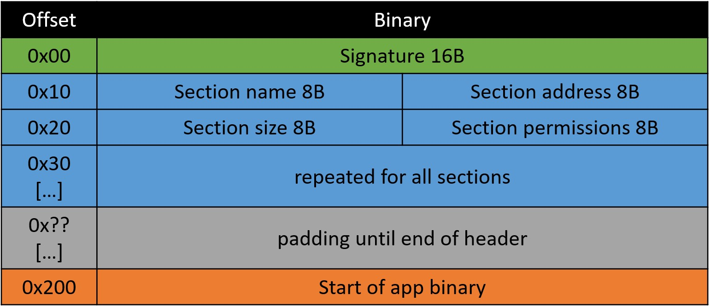

         

<h2 align="center"> <b>KTH Royal Institute of Technology</b> </h2>

<h2 align="center"> <i>D2497 Project course in System Security</i> </h2>

<h2 align="center"> <i>Project Report</i> </h2>

 

<h1 align="center"><b>Code Integrity & Non-executable Data on s3k</b></h1>

 
<i>Authors</i>  
Zacharias Terdin <a href="mailto:zacte@kth.se">(zacte@kth.se)</a>  
Elin Kårehagen <a href="mailto:elikare@kth.se">(elikare@kth.se)</a>

<i>Supervisor</i>    
Henrik Karlsson <a href="mailto:henrik10@kth.se">(henrik10@kth.se)</a>

<i>Examiner</i>  
Roberto Guanciale <a href="mailto:robertog@kth.se">(robertog@kth.se)</a>

 

<h2 align="center"> <i>2023–09-07</i> </h2>

## Countered vulnerabilities

### Introduction

Modern software systems are filled with bugs and security issues mostly as result of the sheer size and complexity of them, which also makes them hard to detect and prevent [[1]](#references). One idea to solve this issue is to implement strong security measures in the most privileged software, the operating system, which hopefully can prevent vulnerabilities in higher level applications from resulting in a system wide compromise. S3k is one such project which aims to create an OS kernel free from bugs, proven by formal methods. 

One of the most common type of software bug within computer security is related to memory vulnerabilities [[2]](#references). Applications written in low level languages that are “memory unsafe” can enable an attacker to alter the program or even gain full control over the control-flow. Memory corruption, code corruption and control-flow hijacking are examples of attacks on memory vulnerabilities. Memory corruption is the start of any attack on memory; a small error in the code that gives an attacker the opportunity to modify the program. This can for example be to force an array pointer to unallocated memory and create a buffer overflow. In a later stage of an attack this can be used to overwrite the program's code leading into a code corruption attack. Another attack vector is control flow hijacking where the instruction pointer is manipulated to point towards code injected by the attacker. Fortunately, there are policies that can be enforced to prevent these kinds of attacks. The goal of this project is to enhance the s3k project security features with a *code integrity policy* and a *non-executable data policy*.

### The security issue

This project covers the prevention of code injection and execution of arbitrary code on s3k. The problem to be solved consists of three parts, a malicious actor can write and execute arbitrary code if:
1. a program can execute code from the memory intended for program data.
2. a program can write code into the section of memory intended for instructions, i.e., the program can rewrite its own code.
3. a program is not authenticated before executing.

This project aims to solve the problem by implementing the write xor execute policy and a method for software authentication. 

### Write xor execute policy

Write xor execute is a policy which is achieved by combining the code integrity policy and the non-executable data policy [[3]](#references). The code integrity policy enforces that memory intended for program code cannot be writable and the non-executable data policy enforces that memory intended for program data (such as stack and heap) cannot be executable. In summary, one piece of memory is *always* either writable or executable and never both at once.

### Software authentication

The purpose of software authentication is to ensures that the software has not been tampered with somewhere between distribution and execution. If we receive a piece of software from a trusted distributor, can we truly know who sent it or that it has not been tampered with in between hands? Yes, or at least we can increase our resilience against these attacks by implementing a method for software authentication. In summary, all code that is executed has to be authenticated beforehand.

## Design choices

The project builds upon the kernel s3k which is developed for RISC-V. The kernel utilizes the concept of *capabilities* to administer process permissions. Capabilities can be understood intuitively by their name: it is a description of what a process is able to do. If a process attempts to perform an action which it does not have a capability for, the kernel will interrupt it. Each process can have multiple capabilities at the same time and of differing types, e.g. one capability might describe which CPU clock cycles it is allowed to run on and another which parts of memory is has access to. The latter type of capability is central to this project. 

The project is mainly divided into two programs: (1) *monitor* and (2) *app*. Monitor will be administrating the app and enforcing the write xor execute policy and software authentication. The purpose of the app is to test the implementation of the monitor. The overall design can be explained with [figure 1](#figure-1-overall-design-flowchart).

  

<i>Figure 1: overall design flowchart</i>

0. Kernel starts and bootstraps monitor. (Not present in figure)
1. The monitor starts.
2. Monitor performs authentication of the app:
   - In case the authentication fails: monitor does not setup and start app, instead jumps to main code. This is a point of no return and requires reset to attempt another authentication.
   - In case the authentication succeeds: monitor setups and starts app.
3. Monitor waits for app to start and send a message.
4. App starts and performs its own setup; sends a message to the monitor when it has finished setup.
5. Monitor and app enter their main code.
6. Monitor waits for the app to send a request. When a request is received:
    - monitor handles it accordingly,
    - sends a response to the app, 
    - returns to the main code and 
    - waits for the app to send a new request.
7. App executes its main code until it gets an exception which requires that it interacts with the monitor:
   - app sends a request to the monitor,
   - waits for its response,
   - handles the response and
   - returns to main code. 

## Implementation details

### Monitor

Monitor is the first user space process which is responsible for administrating capabilities to all other applications which enforce the write xor execute policy. It is also responsible for bootstrapping all other applications after authenticating them. Since the monitor will be creating and revoking capabilities for all applications, it will have the most privileged access to them. The security concerns associated with this design are acknowledged and handled by assuming that the monitor is a trusted and safe application.

### App

As previously mentioned, the app's purpose is to simulate a generic application and test the implementation of the monitor. It mainly consists of test code and code for a trap handler. The tests are written as functions which perform actions which challenges the security implemented by the monitor and the trap handler is a function which is responsible for handling exceptions when the app imminently gets interrupted because it oversteps its capabilities. Within the trap handler the app will decide how it will try to resolve the issue depending on how the monitor responds to its request: 
1. Continue: the monitor approved the request and the app is allowed to continue from where it was interrupted.
2. Soft-reset: the monitor disapproved the request but the app can recover by skipping the routine which caused the interruption.
3. Hard-reset: the monitor disapproved the request leaving the app in an unrecoverable state which forces it to reset itself.

### Capabilities

The app's permissions to memory is controlled by capabilities that the monitor assigns it. Each capability is responsible for a section in the app and has a permissions attached to it, see [figure 2](#figure-2-app-memory-layout). Initially capabilities are created according to the [app's binary header](#table-1-map-of-file-header). It specifies which sections are present, their relative offset in the file, their size and initial permissions. Capabilities are static for all section, meaning that they cannot be changed, except for *.heap*, which is dynamic. The .heap section is unused memory within the app which can be allocated during runtime. It is divided into equal *chunks* of 4KB which all generate an initial capability with read-only permissions. The app can request the monitor to change the permissions of .heap capabilities for each chunk individually. The monitor will always allow that a capability to the heap is changed to being writeable, but will only allow it to be set executable if it passes the authentication.

<i>Figure 2: app memory layout</i>

### Authentication
The technique implemented for generating signatures is by cipher block chaining message authentication code (cbc-mac), and the encryption method used in the block chaining is symmetric aes128. This method was not chosen because it is the most secure or best suited for the purpose of this project, but because it was provided to us as a finished library and made implementing the concept of code authentication simpler. The scenario we have assumed present is that the monitor and distributor of the application share a secret key.

To make the process of authentication as seamless and realistic as possible a file format has been created, the monitor and app need a common way to communicate signatures to one another, see [Figure 3](#figure-3-map-of-file-header). The file header first stores the signature of 16B. The signature is then followed by specific information for each section of the program, this is so the monitor can set up the right memory capabilities before running. The header section info covers text, data, rodata, bss, heap and stack.

The code authentication is done before the application setup and every time the monitor changes the privileges of a memory segment from writable to executable. This is to ensure that the policy of code integrity is properly enforced. The process of authentication can be described with the following three steps:

1.  The distributor calculates the signature of the binary with the secret key and formats the code with the common file format. This includes the signature.
2.  Before setting up and starting the app, the monitor calculates the signature of the code provided and matches it towards the one provided by the distributor. Upon success the monitor starts setting up the app and if the authentication turns out unsuccessful the setup is aborted.
3. If the app requires more memory during runtime, for example software updates, this can be done after another authentication of the new piece of code.

<i>Figure 3: map of file header</i>

## Conclusion

The monitor can counter memory corruption attacks, code corruption attacks and control flow hijacking which are attempted via the app. The write xor execute policy is enforced for all memory which is available to the app and it guarantees code integrity and non-executable data. The policy hinders the app from ever accessing memory it was not intended to access, hinders it from executing data and to rewrite code. Data can be made executable but only if it passes authentication by the monitor. A legitimate case where it would be necessary is if the app requires a software update during runtime.

Lastly, to further strengthen code integrity of the app before it has been executed we have implemented a authentication step. In theory the app should be considered safe if it passes authentication, but there are still ways for the app to be compromised. Two possible scenarios are if the author of the app intentionally writes it to be malicious or if a malicious actor acquires a copy of the secret key. The consequences of such a compromise are however isolated to the app itself and would not be able to escalate to a system wide compromise. A malicious app would not be able to access other processes memory or even elevate its privileges since the monitor acts as the gatekeeper to the capabilities which govern privileges in the operating system.

## Individual contributions

### Elin Kårehagen

Due to joining the course later than Zacharias and lacking some of the required prior knowledge, mostly programming in C, I early on felt it was hard to keep up and make a meaningful contribution. This led to us splitting the project into two separate but still very intertwined branches. I have focused on the process of code authentication. As described above, the aes128 library was provided to us as a resource for this project and a natural next step in this project would probably be to expand to asymmetric encryption. However I perceived this as too big of a project for me, so instead I continued with creating the file format for the application which was more of a challenge in my degree of difficulty. The pieces of code I have produced for this project are getsections.py, app_format.c and the small part in the monitor handling the process of authentication. 

### Zacharias Terdin

Originally I was working alone on this project. I did the initial research and wrote the project proposal and decided on the scope of the project. In the early stages of the project my time was allocated to researching RISC-V in general and to understanding s3k. After that I have developed the repository and almost all of its contents as well as making all the bits and pieces work together. Throughout the project I have been improving the development environment with a working build toolchain and debugging environment for the project, the result of which I am very pleased with.

My most important contributions to the core of the project are the implementation of the monitor and the app. I designed and implemented the monitor's functionality of bootstrapping the app and also handling requests from the app. I also designed and implemented the app's functionality of testing the monitor's features as well as being able to handle and recover from exceptions through a trap handler.

## References

| Index | Reference |
| :---: | :-------- |
| [1] |	KTH-STEP Group, "Separation Kernel," n.d. [Online]. Available: <a href="https://kth-step.github.io/projects/separation-kernel">https://kth-step.github.io/projects/separation-kernel</a>. [Accessed 6 September 2023]. |
| [2] | L. Szekeres, M. Payer, Tao Wei, and D. Song, “SoK: Eternal War in Memory,” in 2013 IEEE Symposium on Security and Privacy, 2013, pp. 48–62. doi: 10.1109/SP.2013.13. |
| [3] | H. Chfouka, H. Nemati, R. Guanciale, M. Dam and P. Ekdahl, "Trustworthy Prevention of Code Injection in Linux on Embedded Devices," in _Computer Security -- ESORICS 2015_, G. Pernul, P. Y. A. Ryan and E. Weippl, Eds., Cham, Springer International Publishing, 2015, pp. 90-107. |
