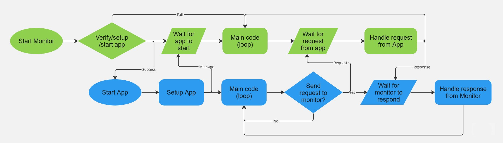
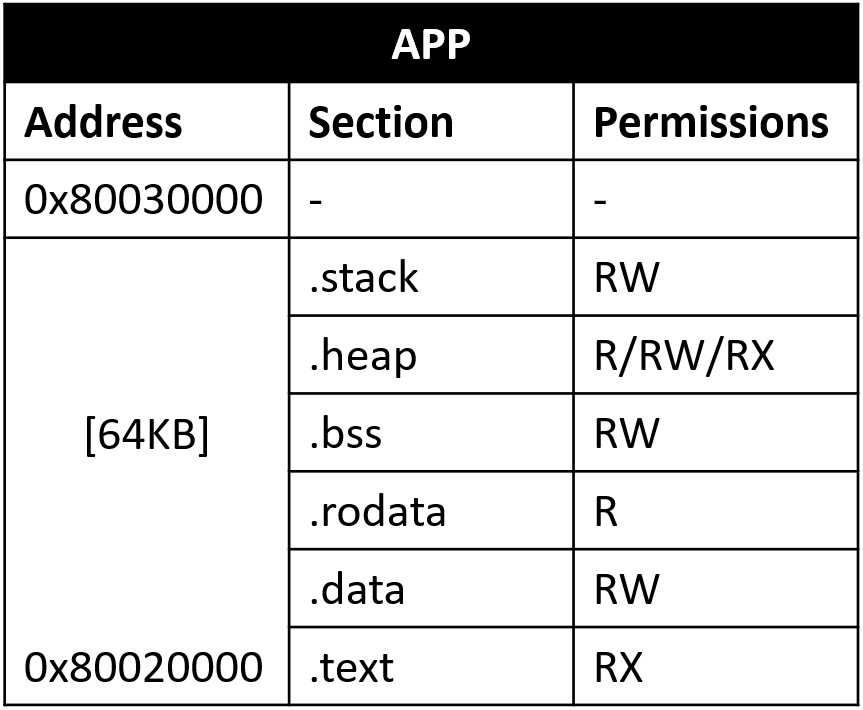

## **KTH**

### *D2497 Project course in System Security*

### *Project Report*

# Code Integrity and Non-executable Data on s3k

*Authors*
Zacharias Terdin [(zacte@kth.se)](mailto:zacte@kth.se)
Elin Kårehagen [(elikare@kth.se)](mailto:elikare@kth.se)

*Supervisor*
Henrik Karlsson [(henrik10@kth.se)](mailto:henrik10@kth.se)

*Examiner*
Roberto Guanciale [(robertog@kth.se)](mailto:robertog@kth.se)

### 2023–07-XX

## Countered vulnerabilities

### Introduction

Almost all software contains bugs and one of the most, if not the most, common type of software bug withing computer security is related to memory vulnerabilities.  Memory corruption, code corruption, control-flow hijacking are some examples of attacks which would allow an attacker to influence a system partially or completely. Fortunately, there exists protective mechanisms to counter these well-known attacks.

### The security issue

This project covers the prevention of code injection and execution of arbitrary code on s3k[[1]](#references). The problem to be solved consists of three parts, a malicious actor can write and execute arbitrary code if:
1. a program can execute code from the memory intended for program data.
2. a program can write code into the section of memory intended for instructions, i.e., the program can rewrite its own code.
3. a program is not authenticated before executing.

This project aims to solve the problem by implementing the write xor execute policy and a method for software authentication. 

### Write xor execute policy

Write xor execute is a policy which is achieved by combining the code integrity policy and the non-executable data policy. The code integrity policy enforces that memory intended for program code cannot be writable and the non-executable data policy enforces that memory intended for program data (such as stack and heap) cannot be executable. In summary, one piece of memory is *always* either writable or executable and never both at once.

### Software authentication

The purpose of software authentication is to ensures that the software has not been tampered with somewhere between distribution and execution. If we receive a piece of software from a trusted distributor, can we truly know who sent it or that it has not been tampered with in between hands? Yes, or at least we can increase our resilience against these attacks by implementing a method for software authentication. In summary, all code that is executed has to be authenticated beforehand.

## Design choices

The project builds upon the kernel s3k which is developed for RISC-V. The kernel utilizes the concept of *capabilities* to administer process permissions. Capabilities can be understood intuitively by their name: it is a description of what a process is able to do. If a process attempt to perform an action which it does not have a capability for, the kernel will interrupt it. Each process can have multiple capabilities at the same time and of differing types, e.g. one capability might describe which CPU clock cycles it is allowed to run on and another which parts of memory is has access to. The latter type of capability is central to this project. 

The project is mainly divided into two programs: (1) *monitor* and (2) *app*. Monitor will be administrating the app and enforcing the write xor execute policy ans software authentication. The purpose of the app is to test the implementation of the monitor. The overall design can be explained with [figure 1](#figure-1-overall-design-flowchart).

  
#### *Figure 1: overall design flowchart*

0. Kernel starts and bootstraps monitor. 
1. The monitor starts.
2. Monitor authenticates the app:
   - Fail -> monitor does not setup and start app, instead jumps to main code **END**
   - Success -> monitor setups and starts app. **PROCEED**
3. Monitor waits for app to start and send a message.
4. App starts and setups itself; sends a message to the monitor when it has finished setting up.
5. Monitor and app enter their main code.
6. Monitor waits for the app to send a request:
   - When a request is received the monitor handles it, sends a response to the app and returns to main code.
7. App executes main code until it gets an exception which requires that it interacts with the monitor:
   - When it sends a request to the monitor it awaits for it to respond, handles the response and returns to main code. 

### Monitor

Monitor is the first user space process which is responsible for administrating capabilities to all other applications which enforce the write xor execute policy. It is also responsible for bootstrapping all other applications after authenticating them. Since the monitor will be creating and revoking capabilities for all applications, it will have the most privileged access to them. This security concern is acknowledged and handled by assuming that the monitor is trusted and safe by some method. 

### App

As previously mentioned, the app's purpose is to simulate a generic application and test the implementation of the monitor. It mainly consists of tests and a trap handler. The tests are written as functions which perform actions which challenges the security implemented by the monitor and the trap handler is a function which is responsible for handling exceptions when the app imminently gets interrupted because it oversteps its capabilities. Within the trap handler the app will decide how it will try to resolve the issue depending on how the monitor responds to its request: 
1. Continue: the monitor approved the request and the app is allowed to continue from where it was interrupted.
2. Soft-reset: the monitor disapproved the request but the app can recover by skipping the routine which caused the interruption.
3. Hard-reset: the monitor disapproved the request leaving the app in an unrecoverable state which forces it to reset itself.

### Capabilities

The app's permissions to memory is controlled by capabilities that the monitor assigns it. Each capability is responsible for a section in the app and has a permissions attached to it, see [figure 2](#figure-2-app-memory-layout). Initially capabilities are created according to the [app's binary header](#authentication). It specifies which sections are present, their relative offset in the file, their size and initial permissions. Capabilities are static for all section, meaning that they cannot be changed, except for *.heap*, which is dynamic. The .heap section is unused memory within the app which can be allocated during runtime. It is divided into equal *chunks* of 4KB which all generate an initial capability with read-only permissions. The app can request the monitor to change the permissions of .heap capability for each chunk individually. The monitor will always allow that a capability to the heap is changed to being writeable, but will only allow it to be set executable if it passes the authentication.

#### *Figure 2: app memory layout*

### Authentication
The technique implemented for generating signatures is by cipher block chaining message authentication code (cbc-mac), and the encryption method used in the block chaining is symmetric aes128. This method was not chosen because it is the most secure or best suited for the purpose, but because it was provided to us as a finished library and made implementing the concept of code authentication simpler. The scenario we have assumed present is that the monitor and distributor of the application share a secret key.

The code authentication is done before the application setup and every time the monitor changes the privileges of a memory segment from writable to executable. This is to ensure that the policy of code integrity is properly enforced. The process of authentication can be described with the following three steps:

1.	The distributor calculates the cbc-mac of the code with the secret key, and formats the code in such a way that the initial 128b of the code contains the signature.
2.	Before loading and setting up the app, the monitor calculates the cbc-mac of the code provided and matches it towards the one provided at distribution. Upon success the monitor starts setting up the app and if the authentication turns out unsuccessful the setup is aborted.
3. If the app requires more memory during runtime, for example software updates, this can be done after another authentication of the new piece of code.

To make the process of authentication as seamless and realistic as possible a custom file format has been created. As mentioned earlier the signature is stored in the first 16 B of the file. The signature is then followed by specific information for each section of the program, this is so the monitor can set up the right memory capabilities before running. The header section info covers text, data, rodata, bss, heap and stack. This information is parsed from app.elf by a python script getsections.py with the help of pyelftools. The sections info is then read by app_format.c which puts together a final file with the complete header. 

A map over the file header:

<table >
    <tr>
        <td colspan="2"> signature 16 B</td>
    </tr>
    <tr>
        <td>section name 8 B</td>
        <td>section address 8 B</td>
    </tr>
    <tr>
        <td>section size 8 B</td>
        <td>section permissions 8 B</td>
    <tr>
        <td colspan="2"> sections info repeated for all sections...</td>
    </tr>
    <tr>
        <td colspan="2"> bloat until end of header</td>
    </tr>
    </tr>
    
</table>

## Implementation details

*work in progress*

## Individual contributions

### Elin Kårehagen

Due to joining the course later than Zacharias and lacking some of the required prior knowledge, mostly programing in C, I early on felt it was hard to keep up and make a meaningful contribution. This led to us splitting the project into two separate but still very intertwined branches. I have focused on the process of code authentication. As described above the ARS128 library was provided to us as a resource for this project and a natural next step in this project would probably be to expand to asymmetric encryption. However I perceived this as too big of a project for me, so instead I continued with creating the file format for the application which was more of a challange in my degree of difficulty. The pieces of code I have produced for this project are genpayload.py, app_format.c and the small part in the monitor handling the process of authentication. I have also been lead on structuring this report. 

### Zacharias Terdin

Originally I was working alone on this project. I did the initial research and wrote the project proposal and decided on the scope of the project. A lot of time in the beginning went to researching RISC-V generally and to try to understand s3k. Throughout the project I have been improving the  development environment with a working build toolchain and debugging environment for the project.

## References
